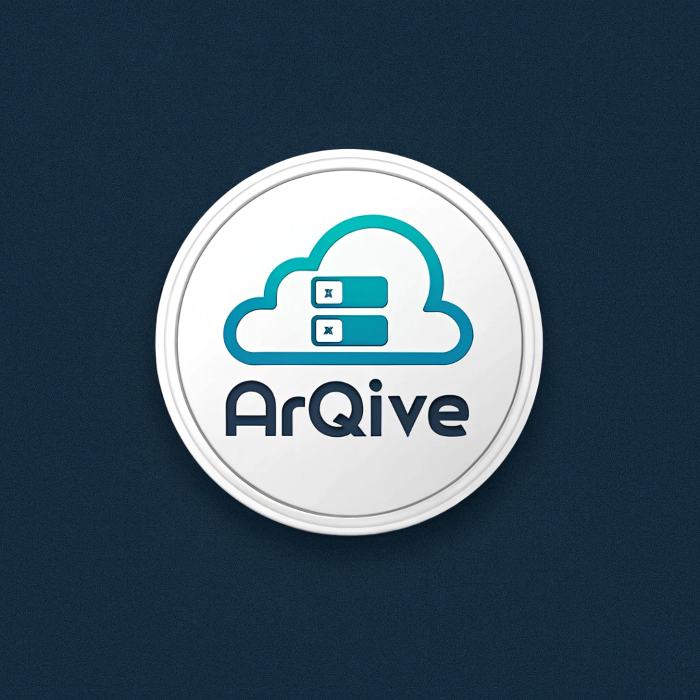

# Arqive - Secure File Storage Platform

A modern, secure file storage and management platform built with Next.js 15, TypeScript, and Appwrite. Arqive provides enterprise-grade security for storing, organizing, and accessing your files from anywhere.

🚀 **Live Demo**: [https://arqive.vercel.app](https://arqive.vercel.app)




## ✨ Features

### 🔐 **Authentication & Security**
- **Dual Authentication Methods**: Email/Password and OTP-based authentication
- **Secure Sessions**: HTTP-only cookies with secure session management
- **Email Verification**: OTP verification for enhanced security
- **User Management**: Complete user registration and profile management

### 📁 **File Management**
- **Multi-format Support**: Documents, Images, Videos, Audio files, and more
- **Drag & Drop Upload**: Intuitive file uploading with progress tracking
- **File Operations**: Rename, delete, share, and download files
- **File Preview**: Built-in thumbnail generation and file previews
- **Storage Limits**: 20GB storage per user with usage tracking

### 🎨 **Modern UI/UX**
- **Responsive Design**: Optimized for desktop, tablet, and mobile devices
- **Dark/Light Mode**: Theme switching support
- **Smooth Animations**: Micro-interactions and loading states
- **Apple-level Design**: Premium, polished interface
- **Real-time Updates**: Live file operations and status updates

### 📊 **Dashboard & Analytics**
- **Storage Analytics**: Visual charts showing storage usage by file type
- **Recent Activity**: Track recently uploaded and modified files
- **Quick Actions**: Fast access to common operations
- **File Categories**: Organized view by Documents, Images, Media, and Others

### 🔍 **Search & Organization**
- **Global Search**: Search across all files with real-time results
- **Smart Filtering**: Filter by file type, date, size, and name
- **Sorting Options**: Multiple sorting criteria for better organization
- **File Sharing**: Share files with other users via email

## 🚀 Tech Stack

### **Frontend**
- **Next.js 15** - React framework with App Router
- **TypeScript** - Type-safe development
- **Tailwind CSS** - Utility-first CSS framework
- **Radix UI** - Accessible component primitives
- **React Hook Form** - Form management with validation
- **Sonner** - Toast notifications
- **Lucide React** - Beautiful icons

### **Backend & Database**
- **Appwrite** - Backend-as-a-Service platform
- **Node Appwrite SDK** - Server-side Appwrite integration
- **File Storage** - Secure cloud file storage
- **Real-time Database** - Document-based database

### **Development Tools**
- **ESLint** - Code linting and formatting
- **PostCSS** - CSS processing
- **Turbopack** - Fast development builds

## 📦 Installation

### Prerequisites
- Node.js 18+ 
- npm or yarn
- Appwrite account and project

### 1. Clone the Repository
```bash
git clone https://github.com/yourusername/arqive.git
cd arqive
```

### 2. Install Dependencies
```bash
npm install
# or
yarn install
```

### 3. Environment Setup
Create a `.env.local` file in the root directory:

```env
# Appwrite Configuration
NEXT_PUBLIC_APPWRITE_ENDPOINT=https://cloud.appwrite.io/v1
NEXT_PUBLIC_APPWRITE_PROJECT_ID=your_project_id
NEXT_PUBLIC_APPWRITE_DATABASE=your_database_id
NEXT_PUBLIC_APPWRITE_USERS=your_users_collection_id
NEXT_PUBLIC_APPWRITE_FILES=your_files_collection_id
NEXT_PUBLIC_APPWRITE_BUCKET=your_bucket_id
NEXT_APPWRITE_SECRET=your_api_secret_key
NEXT_PUBLIC_APPWRITE_OTP=your_otp_collection_id
```

### 4. Appwrite Setup

#### Create Collections:
1. **Users Collection** (`users`)
   - `accountId` (string, required)
   - `email` (string, required, unique)
   - `fullname` (string, required)
   - `avatar` (string, required)

2. **Files Collection** (`files`)
   - `type` (string, required)
   - `name` (string, required)
   - `url` (string, required)
   - `extension` (string, required)
   - `size` (integer, required)
   - `owner` (string, required)
   - `accountId` (string, required)
   - `users` (array, required)
   - `bucketFileId` (string, required)

#### Create Storage Bucket:
- Create a storage bucket for file uploads
- Configure appropriate permissions

### 5. Run the Development Server
```bash
npm run dev
# or
yarn dev
```

Open [http://localhost:3000](http://localhost:3000) to view the application.

## 🏗️ Project Structure

```
arqive/
├── app/                          # Next.js App Router
│   ├── (auth)/                   # Authentication pages
│   │   ├── sign-in/             # Sign in page
│   │   ├── sign-up/             # Sign up page
│   │   └── layout.tsx           # Auth layout
│   ├── (root)/                   # Main application
│   │   ├── [type]/              # Dynamic file type pages
│   │   ├── layout.tsx           # Main layout
│   │   └── page.tsx             # Dashboard
│   ├── context/                  # React contexts
│   ├── globals.css              # Global styles
│   └── layout.tsx               # Root layout
├── components/                   # Reusable components
│   ├── ui/                      # UI components (Radix UI)
│   ├── skeletons/               # Loading skeletons
│   ├── ActionDropdown.tsx       # File actions menu
│   ├── AuthForm.tsx             # Authentication form
│   ├── Card.tsx                 # File card component
│   ├── Chart.tsx                # Storage usage chart
│   ├── FileUploader.tsx         # File upload component
│   ├── Header.tsx               # Application header
│   ├── Search.tsx               # Global search
│   ├── Sidebar.tsx              # Navigation sidebar
│   └── ...
├── lib/                         # Utility libraries
│   ├── actions/                 # Server actions
│   ├── appwrite/               # Appwrite configuration
│   └── utils.ts                # Utility functions
├── public/                      # Static assets
│   └── assets/                 # Icons and images
├── types/                       # TypeScript type definitions
└── ...config files
```


## 🔧 Configuration

### File Upload Limits
- Maximum file size: 50MB per file
- Total storage: 20GB per user
- Supported formats: All common file types

### Security Features
- HTTPS enforcement
- Secure cookie settings
- Input validation and sanitization
- File type validation

## 🚀 Deployment

### Vercel (Recommended)
1. Push your code to GitHub
2. Connect your repository to Vercel
3. Add environment variables in Vercel dashboard
4. Deploy automatically

### Other Platforms
The application can be deployed on any platform that supports Next.js:
- Netlify
- Railway
- DigitalOcean App Platform
- AWS Amplify

**Arqive** - Your digital world, safely Arqived. 🔒
